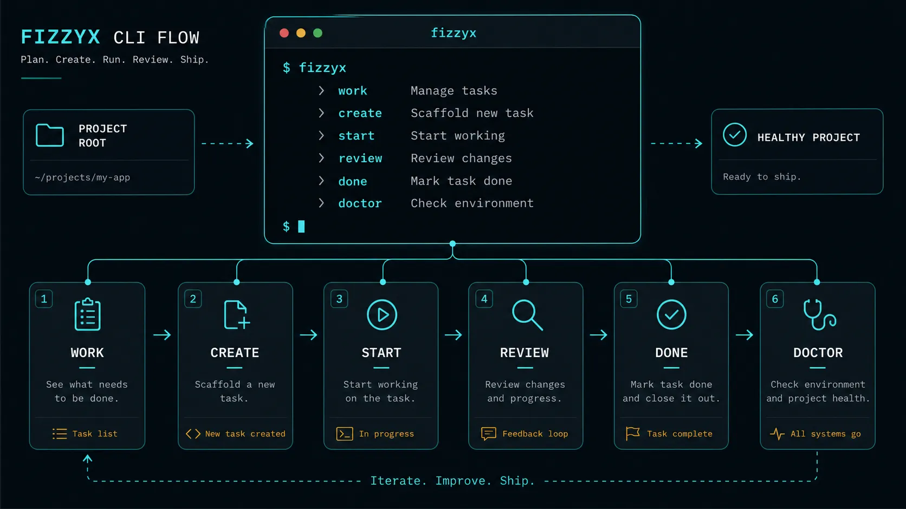
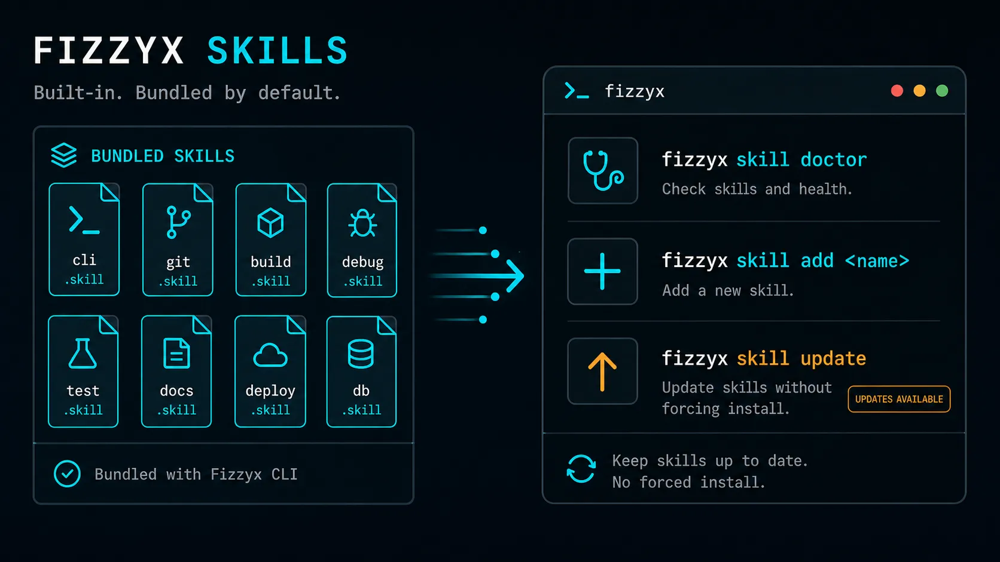
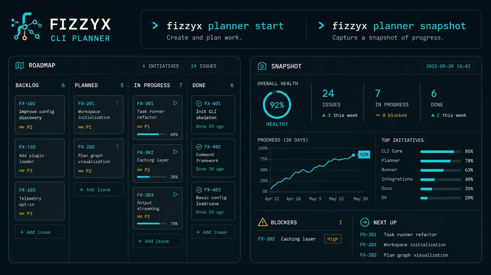
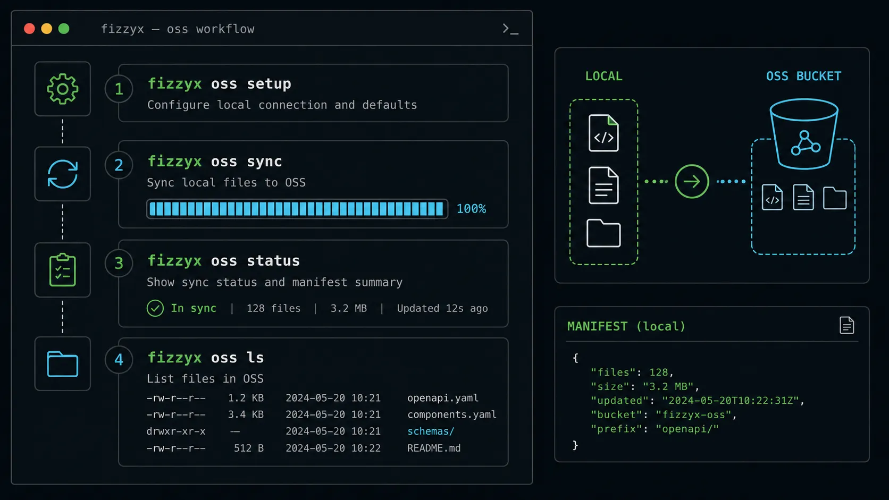
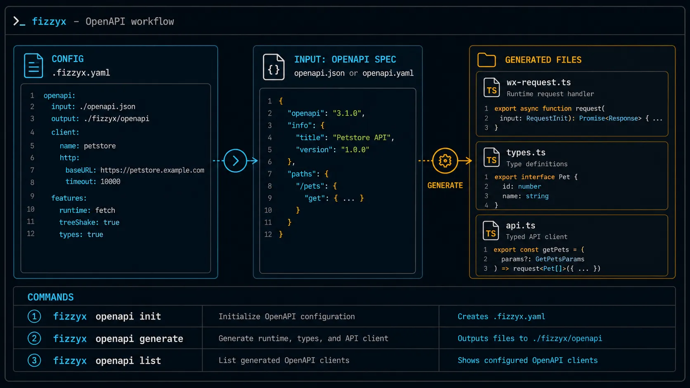

# fizzyx

> CLI tool for Fizzy board workflow, OSS/S3-compatible storage, and OpenAPI client generation.


## Install

```sh
bun add -g @puffinstudio/fizzyx
```

## Flow Commands

Use `.fizzyx.yaml` as the project config file for board and workflow settings.

```sh
fizzyx flow work
fizzyx flow list [--indexed-by <lane>] [--search <terms>] [--json]
fizzyx flow search "<query>" [--all-boards] [--json]
fizzyx flow columns
fizzyx flow create --draft
fizzyx flow create "<title>" --desc <draft-path>
fizzyx flow create "<title>" --assign <user> --desc <draft-path>
fizzyx flow edit <card> --draft
fizzyx flow edit <card> [--title "<title>"] [--desc <file|->]
fizzyx flow assign <card> <user>
fizzyx flow comment <card> "<body>"
fizzyx flow show <card>
fizzyx flow move <card> <column-id-or-name>
fizzyx flow start <card>
fizzyx flow review <card>
fizzyx flow done <card> "commit <sha>: <subject>"
fizzyx flow reopen <card>
fizzyx flow block <card> "<reason>"
fizzyx flow unblock <card> "<reason>"
fizzyx flow untriage <card>
fizzyx flow doctor
fizzyx flow repair
```

`flow done` requires all steps to be complete and closes the card into Done.
`flow create` expects the standard draft shape with a `## Steps` task list; generate it with `flow create --draft` instead of passing plain text.
`flow create` does not assign by default. Use `--assign <user>` while creating or `flow assign <card> <user>` afterwards.
Drafts are stored outside the worktree in Git-local state (or the user state directory outside a Git repository). `flow edit <card> --draft` rebuilds one from the remote card.
`flow edit` updates the title, description, or both. Description input accepts a standard card draft file or `-` for stdin and synchronizes its `## Steps` task list.
`flow columns` lists the real columns and IDs on the configured board. `flow move` is the column-agnostic primitive for custom Fizzy boards. `flow start` uses the configured `in_progress` column; `flow review` is a convenience command for the built-in REVIEW preset.
`flow move` also accepts the Fizzy system targets `maybe`/`triage` and `not-now`; closing remains guarded by `flow done`.
`flow list` filters cards on the configured board, while `flow search` uses Fizzy full-text search and filters results back to the project board unless `--all-boards` is passed. `flow comment` records a standardized note.
`flow reopen`, `flow unblock`, and `flow untriage` provide the inverse lifecycle actions. Unblock returns the card to the configured default column; untriage returns it to Fizzy's system Maybe state.
High-frequency flow commands accept `--json` and return an `ok`/`data`/`summary` envelope with next-action breadcrumbs for agents.
Normal flow commands never create or rename board columns. When `flow:` is missing, explicit `fizzyx init` installs the bundled preset; custom boards can map their existing default and in-progress column IDs in `.fizzyx.yaml` and use `flow move` for all other transitions.
`flow improve` is retained as a deprecated compatibility alias; use `fizzyx skill run improve-codebase` for the actual codebase workflow.

On successful initialization, `fizzyx init` also creates `AGENTS.md` when it is missing or
updates a marker-delimited FizzyX development workflow section in the existing file. Other
project instructions are preserved, and repeated initialization does not duplicate the section.

Agent loop for card-backed code work:

```sh
fizzyx flow work
fizzyx flow show <card>
fizzyx dev status --agent
fizzyx dev start <slug> --kind <feature|fix|hotfix|ops|chore|docs> --card <card>
fizzyx flow start <card>
fizzyx dev ready --agent
fizzyx flow review <card>
fizzyx flow done <card> "commit <sha>: <subject>"
```

Use `fizzyx skill ...` for bundled skills and project pins. Use flow commands for repair and health checks.



## Dev Commands (AI Agent Git Workflow)

Use these for guard-railed branching and promotion checks (documented in
`docs/ai-agent-git-workflow.md`):

```sh
fizzyx dev status --agent
fizzyx dev start <slug> --kind <feature|fix|hotfix|ops|chore|docs> [--card <id>]
fizzyx dev sync
fizzyx dev checkpoint [--message <message>]
fizzyx dev baseline <show|accept>
fizzyx dev ready [--agent] [--full]
fizzyx dev promote <source> --to <environment|main> --dry-run
fizzyx dev cleanup [--confirm-delete]
fizzyx dev doctor
```

Branch/card associations live in local Git config. Unchanged pre-existing worktree files may be accepted with `dev baseline accept`; readiness receipts are stored under `.git/fizzyx/` and are invalidated when HEAD changes. `.fizzyx.yaml` remains shared project policy only.

Production promotions stay guarded:

```sh
fizzyx dev promote <source> --to main --dry-run   # preview + blocking checks
fizzyx dev promote <source> --to main --apply --confirm-production
```

## Skill Commands

```sh
fizzyx skill list
fizzyx skill init --project
fizzyx skill init --global
fizzyx skill add <source>
fizzyx skill remove <name>
fizzyx skill update [name] [--global]
fizzyx skill info <name>
fizzyx skill run <name>
fizzyx skill doctor
fizzyx skill migrate --check
fizzyx skill migrate --apply
```

The bundled `coding-standards` skill covers repository-aware code style, code quality,
naming, and safe tool usage. The aliases `code-style`, `code-quality`, `naming`, and
`tool-usage` all resolve to that single skill. It includes a conditional TypeScript, React,
Bun/pnpm, and OXC profile while leaving exact scripts and framework policy to each project.

Built-in skills remain available from the fizzyx release without installation. Top-level
`fizzyx init` maintains the project's `AGENTS.md` instructions but does not copy skills. Use `skill init --project` for `.agents/skills`, or
`skill init --global` for `~/.agents/skills`; initialization preserves existing files.
`skill add <source>` records a project pin and materializes that skill in the project.
`skill update [name]` refreshes project files by default; pass `--global` explicitly for
the global copy.



## Planner Dashboard

Start a local planner dashboard backed directly by the Fizzy API:

```sh
fizzyx planner start
fizzyx planner snapshot
```



`planner snapshot` prints the same JSON used by the web dashboard. Project workflow uses `BACKLOG → READY → IN PROGRESS → REVIEW → DONE`, with `DONE` coming from closed cards and `BLOCKED` from Not Now/postponed cards.

Planner conventions use tags for filtering:

```text
priority:p0 priority:p1 priority:p2
type:bug type:feature type:chore type:blocker
area:frontend area:api phase:integration
```

Cards can also include frontmatter for richer project details:

```md
---
priority: P1
type: feature
owner: ellen
depends_on: [123]
---
```

`api_status:*` and `skill:*` are not standard tags in 1.0 and are treated as free-form tags only.

## OSS Commands

Manage S3-compatible object storage (Alibaba Cloud OSS, AWS S3, MinIO, etc.).

### Setup

```sh
# Interactive — prompts for keys, stores in OS keychain
fizzyx oss setup

# With explicit config (keys are prompted separately)
fizzyx oss setup --env dev --endpoint https://oss-cn-beijing.aliyuncs.com --region cn-beijing --local-dir ./public [--bucket my-bucket] [--remote-prefix assets]

# Configure keys for an existing environment
fizzyx oss setup --env dev
```

- `--endpoint` and `--region` are required
- `--bucket` is optional — omit if your endpoint already includes the bucket name (e.g. `https://my-bucket.oss-cn-beijing.aliyuncs.com`)
- `--remote-prefix` is optional — omit to upload to bucket root
- Credentials are stored in OS keychain via `Bun.secrets`, never in config files or shell history
- Without `--env`, keys are stored as `default` — all environments fall back to it



### Sync

Upload local files to the remote bucket:

```sh
fizzyx oss sync [--env dev] [--full] [--no-urls] [--verify]
```

- `--env`: environment name (default: `dev`)
- `--full`: ignore cached manifest, force full re-upload
- `--no-urls`: suppress file URL output
- `--verify`: check remote existence before skipping (re-upload if deleted remotely)

Sync uses a two-stage check (mtime+size → SHA-256 hash) to skip unchanged files. The manifest is stored at `.fizzyx/oss-manifest.json` and can be committed for team sharing.

During sync, a live progress bar shows current file, progress, and status:

```
  ◐ dev [████░░░░░░░░░░░░] 25%  ↑ filename.jpg
```

### List

List objects in the remote bucket in a tree view with file sizes:

```sh
fizzyx oss ls [--env dev] [--prefix assets/]
```

```
└── assets/
    └── Monkey_D._Luffy_Anime_Post_Timeskip_Infobox.webp  126.2 KB
```

- `--prefix`: filter objects by key prefix

### Status

Show sync status (pending uploads, manifest info):

```sh
fizzyx oss status [--env dev]
```

List exact pending files without uploading:

```sh
fizzyx oss status --files
```

## OpenAPI Commands

Generate a typed API client from an OpenAPI spec.

### Generate

```sh
fizzyx openapi generate -i <url|path> -o <dir> -c wx
```

Options:

| Flag                       | Description                                             |
| -------------------------- | ------------------------------------------------------- |
| `-i, --input <url\|path>`  | OpenAPI spec URL or file path (JSON/YAML)               |
| `-o, --output <dir\|file>` | Output directory (or `.ts` path for custom api name)    |
| `-c, --client <name>`      | Client target (`wx`)                                    |
| `--api-name <name>`        | API filename (default: `api.ts`)                        |
| `--types-name <name>`      | Types filename (default: `types.ts`, `false` to inline) |
| `--runtime-name <name>`    | Runtime filename (default: `wx-request.ts`)             |
| `--run <script\|cmd>`      | npm script or shell command after generation            |

If `--input`/`--output`/`--client` are omitted, values from `.fizzyx.yaml` `openapi[0]` are used.

Output is 3 files — runtime, types, and tree-shakeable endpoint functions:

```
src/api/
  ├── wx-request.ts   # runtime (configure, setToken, onError, request)
  ├── types.ts        # named interfaces / enums / aliases
  └── api.ts          # tree-shakeable export functions + param types
```

### Admin App

Generate a standalone shadcn admin project with a typed fetch client and TanStack Query hooks:

Prerequisites are Bun, Git, and network access to the framework and shadcn registries. pnpm is
only needed for the guarded compatibility fallback.

```sh
fizzyx openapi admin \
  --input ./openapi.json \
  --output ./pet-admin \
  --framework nextjs
```

URLs work as input too:

```sh
fizzyx openapi admin -i https://api.example.com/openapi.json -o ./admin --framework tanstack-start
```

Use `--framework tanstack-start` for TanStack Start, or add `--dry-run` to inspect the
scaffold commands without creating files. The generator uses the official framework
scaffolds, Bun and `bunx` by default, and only falls back to pnpm for a known Bun
compatibility failure. It never invokes npm or npx.

Generated admin projects include:

- shadcn components installed with `shadcn add --all`
- TanStack Table list pages with OpenAPI-aware pagination, search, filtering, and sorting
- schema-driven TanStack Form create/edit pages with shadcn Field controls
- detail/delete routes and a typed fetch + TanStack Query client
- `NEXT_PUBLIC_API_BASE_URL` (Next.js) or `VITE_API_BASE_URL` (TanStack Start) support
- `configureAdminApi({ token, headers, ... })` for runtime authentication configuration
- `.fizzyx/admin-manifest.json` regeneration safety that preserves user-edited generated files

The main generated structure is:

```text
src/
  components/admin/       # shell, DataTable, DynamicForm, query provider
  lib/api/generated/      # fetch runtime, types, endpoints, query hooks
  lib/api/admin-api.ts    # environment and runtime API configuration
  app/(admin)/            # Next.js routes (Next.js target)
  routes/_admin/          # file routes (TanStack Start target)
.fizzyx/admin-manifest.json
```

The output directory must be empty on the first run. Re-run the same command to update
unchanged generated files; local edits are reported and preserved as conflicts.

Resource inference intentionally targets tagged, conventional collection/member CRUD paths.
Unmapped operations remain callable through the generated client and are reported as diagnostics.
List parameter inference recognizes common page/offset/limit/search/sort names; custom envelopes,
authorization UI, relationships, file inputs, and router-only TanStack projects are not inferred.

### Generated Runtime API

```ts
import { configure, setToken, onError, initToken } from "./api";

// Setup at app startup
configure({ baseUrl: "https://api.example.com", storageKey: "myapp_token" });

// Or with custom logger + hooks
configure({
	baseUrl: "https://api.example.com",
	storageKey: "tb_token",
	logger: { error: myReporter, warn: () => {}, info: () => {}, debug: () => {} },
	hooks: [
		{ onError: (ctx) => wx.showToast({ title: ctx.message }) },
		{ onSuccess: (ctx) => reportAnalytics(ctx) },
	],
});

// Token auto-loads from storage. Explicit load if needed:
await initToken();

// Token persists to storage on set
setToken("jwt...");
setToken(null); // logout, clears storage
```

**Logger vs Hooks:**

- `Logger` controls **output** (console, file, sentry). Default: `console.error/warn/info/debug` with `[fizzyx]` prefix.
- `RequestHook` fires **business callbacks** at lifecycle points (`onRequest`, `onSuccess`, `onError`). Use for toast, analytics, loading state.

### Generated Endpoint API

Each endpoint is a standalone export function with typed params:

```ts
import { listPets, createPet, ListPetsQueryParams } from "./api";

// GET with query params
const pets = await listPets({ query: { limit: 10, status: "available" } });

// POST with body
const pet = await createPet({ name: "Fluffy" });

// POST without requestBody (no data param generated)
const result = await someAction();
```

- No `createApi()` wrapper — tree-shakeable by default
- Each function exports its param types (`ListPetsQueryParams`, `CreatePetPathParams`)
- JSDoc comments from OpenAPI `description`/`summary` on endpoints and params

### List Generators

```sh
fizzyx openapi list
```



### Initialize OpenAPI config

```sh
fizzyx openapi init
```

### Config (`.fizzyx.yaml`)

```yaml
openapi:
  - input: ./openapi.json
    output: ./src/api
    client: wx
    api_name: sdk.ts
    types_name: types.ts
    runtime_name: wx-request.ts
    run: check
```

## Config File (`.fizzyx.yaml`)

Minimal OSS-only config:

```yaml
oss:
  dev:
    endpoint: https://oss-cn-beijing.aliyuncs.com
    region: cn-beijing
    bucket: my-bucket
  sync:
    local_dir: ./public
    remote_prefix: assets
    concurrency: 10
```

If your endpoint already contains the bucket in the hostname, `bucket` can be omitted:

```yaml
oss:
  dev:
    endpoint: https://my-bucket.oss-cn-beijing.aliyuncs.com
    region: cn-beijing
  sync:
    local_dir: ./public
```

## Credential Resolution

Credentials are resolved in this priority order:

1. OS keychain (`Bun.secrets` — set via `fizzyx oss setup`)
2. Environment variables: `OSS_<ENV>_ACCESS_KEY_ID` / `OSS_<ENV>_SECRET_ACCESS_KEY`
3. `.fizzyx.yaml` `access_key_id` / `secret_access_key` fields (legacy, discouraged)

Credentials stored as `default` (without `--env`) are used as a fallback for all environments when no env-specific key is found. This means you only need to run `fizzyx oss setup` once — dev, prod, and any other env will reuse the same keys.
